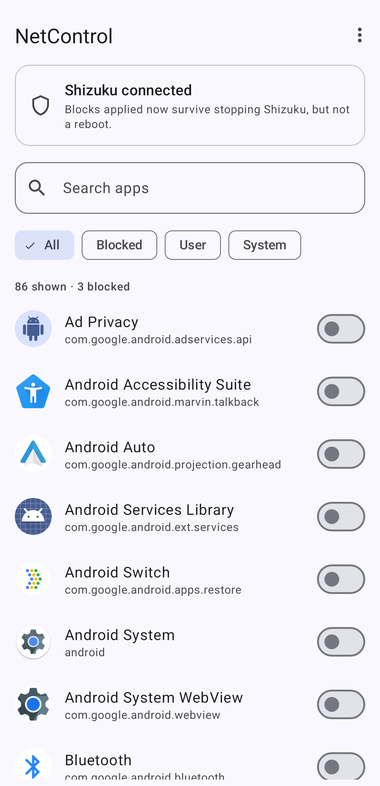
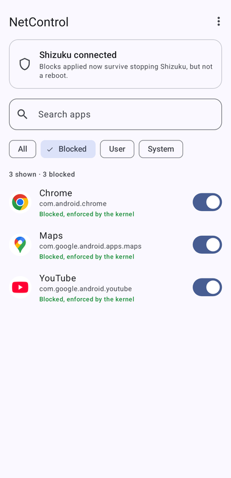
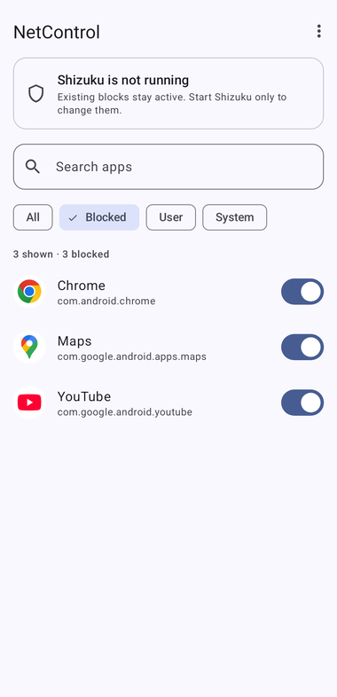

# NetControl

Cut any app off **WiFi and mobile data** on an unrooted phone. No VPN, no root,
and nothing running in the background.

<p align="center">
  
  
  
</p>

Android has no built in way to do this. Samsung's *Allowed networks for apps*
lets you disable WiFi **or** mobile data for an app, never both. Every other no
root firewall (NetGuard, Blokada, TrackerControl, RethinkDNS) works by declaring
itself a VPN, which occupies your one and only VPN slot and costs battery.
NetControl does neither.

## How it works

Shizuku lends the app shell (ADB) privileges just long enough to run Android's
own firewall commands:

```
cmd connectivity set-chain3-enabled true
cmd connectivity set-package-networking-enabled false <package>
```

That sets the app's deny bit in `FIREWALL_CHAIN_OEM_DENY_3`, a kernel BPF
firewall map owned by `netd`. The block is enforced below the app layer, so it
covers WiFi and cellular identically and costs no battery.

**The rule lives in the kernel, not in NetControl and not in Shizuku.** Shizuku
is only the delivery mechanism; once a command has run, nothing links the rule
back to it. That has one very useful consequence:

> ### Shizuku does not need to keep running
> You only need it at the moment you change a block. Apply your blocks, then
> force stop Shizuku and turn Wireless debugging back off. The blocks stay
> active with nothing running in the background.

A reboot clears the map. That is the one unavoidable cost of not using a VPN or
root, and NetControl re-applies your blocks automatically the next time you open
it with Shizuku available.

## Requirements

**Android 15 or newer.** These `cmd connectivity` subcommands were added in
Android 15. They do not exist on Android 14, where every toggle fails.
See [Verified behaviour](#verified-behaviour).

## One time setup

1. Install **Shizuku** (Play Store, or [RikkaApps/Shizuku](https://github.com/RikkaApps/Shizuku)).
2. Settings, About phone, Software information, tap **Build number** 7 times.
3. Settings, Developer options, turn on **Wireless debugging**.
4. Open Shizuku, **Start via Wireless debugging**, follow the pairing steps.
5. Open NetControl and tap **Allow** on the permission card.

## Daily use

Flip the switch next to any app. The line under its name reports the **real
kernel state**, read straight back after every write:

| | |
|---|---|
| *Blocked, enforced by the kernel* | the rule is live |
| *Command ran but the rule did not stick* | the write was rejected, so the app is **not** blocked |
| *Could not read state: ...* | the command failed, and the raw error is shown |

The header counts anything that is **NOT enforced**, so a silent failure cannot
hide. **Menu, Verify blocks** re-reads every saved block without changing
anything.

Once you are done, stop Shizuku. Your blocks remain.

## After a reboot

Start Shizuku (step 4, no re-pairing needed) and open NetControl. Saved blocks
are re-applied automatically on launch. Then stop Shizuku again.

**Menu, Re-apply blocks** does the same thing manually if you need it.

## Verified behaviour

Tested end to end on an Android 16 emulator (API 36), with Shizuku started over
ADB so it ran at the same shell UID it uses on a real phone. Command
availability was also checked on Android 14 and 15:

| Check | Result |
|---|---|
| Commands exist and run at shell UID (not root) | yes on Android 15 and 16, **no on Android 14** |
| Blocking a package sets its deny bit | `com.android.chrome:deny`, `chain:enabled` |
| A blocked browser actually loses network | `ERR_NAME_NOT_RESOLVED`, while the device itself still pings |
| Blocks survive killing the Shizuku server | yes, still `:deny` with no Shizuku process alive |
| Blocks survive a reboot | no, `chain:disabled` and every package back to `:allow` |
| Opening the app after a reboot restores them | yes, automatically, with no button press |

The one thing an emulator cannot answer is whether a specific OEM also uses
`FIREWALL_CHAIN_OEM_DENY_3` for its own features and overwrites these rules. If
blocks turn red after a system settings change, that is the likely cause.

## Build

CI builds a debug APK on every push and attaches it to a
[Release](../../releases). Locally you need **JDK 17** (not newer, since AGP
8.5.2 will not run on it) and an Android SDK with platform 34:

```
./gradlew assembleDebug
```

> Installing over an older NetControl fails with a signature mismatch, because
> the CI debug key differs from earlier builds. Uninstall first.

## Limitations

- Blocks are cleared by a reboot, then re-applied when you next open the app.
- Requires Android 15. Android 14 and older lack the commands entirely.
- Reinstalling a blocked app changes its UID, so re-apply after that.
